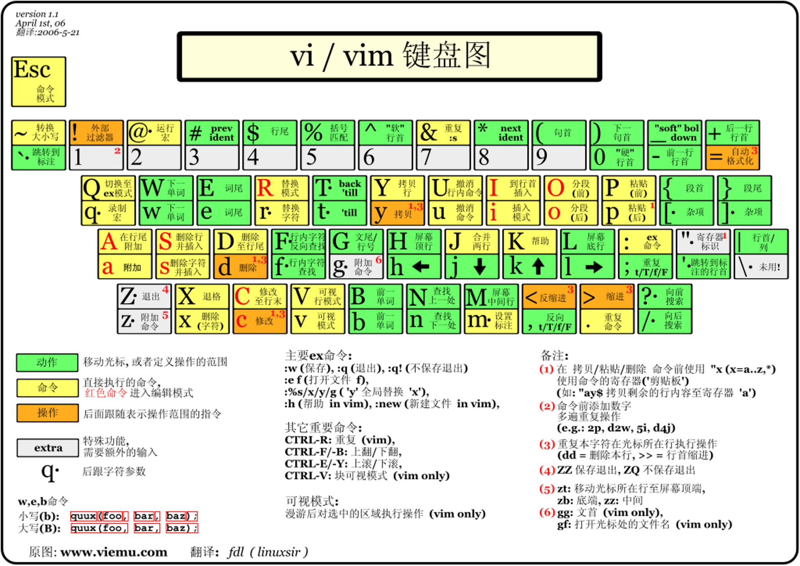

d operator + （count）motion

w整个单词，直到下个单词首字母,b向前一个单词 e end单词的剩余部分, $ 一行剩余部分。

 

2w,移动两个单词，到两个单词后的首部，3e,三个单词后的尾部，0一行的开头

x删除，r替换，c修改，y复制， p粘贴

ctr+o 执行后退，ctr+i执行后退，没搞懂。。。。。

To substitute new for the first old in a line type  :s/old/new

   To substitute new for all 'old's on a line type    :s/old/new/g

   To substitute phrases between two line #'s type    :#,#s/old/new/g

   To substitute all occurrences in the file type    :%s/old/new/g

   To ask for confirmation each time add 'c'       :%s/old/new/gc

笨方法学vim: https://www.kancloud.cn/kancloud/learn-vimscript-the-hard-way/49321